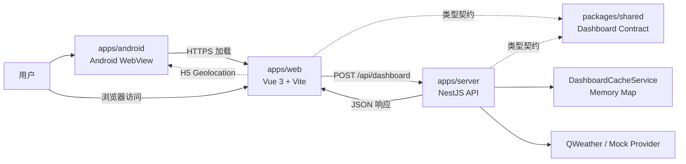
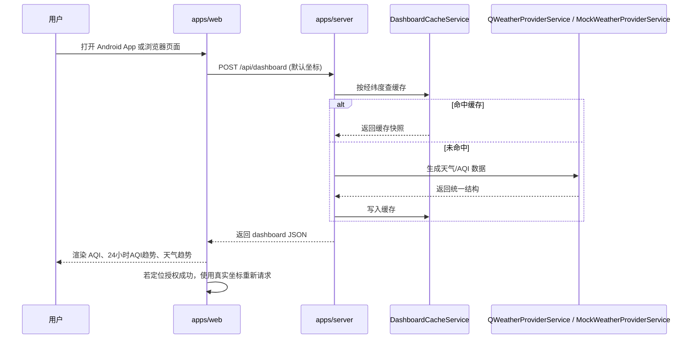

# AirNow 架构说明

本文档描述当前 AirNow 项目的系统边界、Web/Server/Android 交互过程和主要服务组件。

## 1. 系统目标

当前系统聚焦一个简单但完整的业务闭环：

- 前端 H5 页面展示当前空气质量、未来 24 小时 AQI 趋势和未来天气趋势
- Android App 通过 WebView 加载远端 H5 页面
- 前端将经纬度提交给后端
- 后端统一返回适合页面渲染的结构化数据
- 当前不使用数据库，优先保证接口清晰、链路可运行、便于后续替换真实 Provider

## 2. 系统边界

当前工程包含三个运行单元和一个共享代码包：

- `apps/web`
  移动端 H5 前端，负责用户界面和接口调用
- `apps/server`
  后端 API 服务，负责参数校验、数据拼装、缓存和 Provider 封装
- `apps/android`
  Android WebView 宿主，负责加载远端 H5、处理定位权限与外链跳转
- `packages/shared`
  前后端共享的 dashboard 领域模型与接口契约

系统外部依赖当前已经接入 QWeather，同时保留 mock provider 作为联调和降级方案。

## 3. 总体架构



核心思路是：

- 前端不直接访问第三方天气服务
- Android 只作为宿主加载可信站点，业务逻辑仍集中在 H5 与 API
- 后端对外暴露统一领域模型
- `packages/shared` 统一维护接口契约
- Provider 可替换，页面结构尽量不随供应商变动

## 4. 技术栈和关键配置

| 分类 | 当前实现 |
| --- | --- |
| Web | Vue 3 + Vite + TypeScript |
| 图表 | 自绘轻量 SVG，当前未引入 ECharts |
| Server | NestJS + TypeScript |
| 外部请求 | Axios |
| 配置 | `.env` + `apps/server/src/config.ts` |
| 缓存 | `DashboardCacheService` 内存 `Map` |
| Shared | TypeScript 类型声明包 `@airnow/shared` |
| Android | Kotlin + Android Gradle Plugin + WebView |
| Provider | QWeather / Mock Provider |

关键环境变量：

```bash
PORT=3000
API_PREFIX=/api
WEATHER_PROVIDER=mock
QWEATHER_HOST=https://devapi.qweather.com
QWEATHER_TOKEN=your-token
```

`WEATHER_PROVIDER=mock` 适合本地联调；切换为 `qweather` 时必须配置 `QWEATHER_TOKEN`。

## 5. 服务组件说明

### 5.1 前端组件

前端主要由以下部分组成：

- `App.vue`
  页面编排层，组织展示组件、城市切换、首次加载和 H5 定位触发
- `useDashboard`
  页面请求逻辑层，负责调用 `/api/dashboard`、维护 `loading/error/data`
- `packages/shared`
  维护前端直接消费的 dashboard 请求/响应类型
- `LocationHeader`
  保留的头部展示组件，可用于展示城市、坐标、Provider 和刷新入口
- `AirQualityCard`
  展示 AQI 主卡片、空气质量描述和六项污染物指标
- `PollutantGrid`
  保留的独立污染物面板组件
- `HourlyAirForecastCard`
  展示未来 24 小时 AQI 趋势
- `ForecastChart`
  展示未来几天的最高温、最低温与湿度趋势
- `StatusOverlay`
  处理加载、错误和空数据态

前端启动时先用默认坐标加载数据；如果浏览器或 WebView 授权定位，再用真实经纬度重新请求。用户也可以切换预置城市。

### 5.2 后端组件

后端主要由以下模块构成：

- `AppModule`
  根模块，装配全部功能模块
- `HealthModule`
  提供健康检查接口，方便探活与联调
- `DashboardModule`
  核心业务模块，负责仪表盘数据聚合
- `DashboardRequestDto`
  只接收 `latitude` 和 `longitude`，通过 `class-validator` 校验
- `DashboardService`
  负责缓存命中判断和统一响应
- `DashboardCacheService`
  以内存方式缓存仪表盘数据
- `QWeatherProviderService`
  对接真实天气与空气质量接口
- `MockWeatherProviderService`
  生成稳定的 mock 天气与空气质量数据，用于联调与回退

服务端开启全局 `/api` 前缀、CORS 和 `ValidationPipe`。`POST /api/dashboard` 请求体中携带 `latitude/longitude` 以外字段会返回 400。

### 5.3 Android 组件

Android 宿主主要由以下部分组成：

- `MainActivity`
  初始化 WebView，加载远端 H5 页面，处理页面状态保存与返回导航
- `WebChromeClient`
  响应 H5 geolocation 授权请求
- `WebViewClient`
  约束站内加载，外链交给系统浏览器处理
- Adaptive Icon 资源
  当前仍是占位图标，后续需要替换为正式品牌 Logo

Android 当前配置：

- 包名：配置于 `local.properties`，通过 `APP_PACKAGE` 注入 `applicationId` / `namespace`
- 入口 URL：配置于 `local.properties`，通过 `BuildConfig.WEB_URL` 注入
- `minSdk = 24`
- `targetSdk = 34`
- `versionName = "1.0.0"`

`MainActivity` 还负责启用 JavaScript、DOM Storage、Viewport 和默认缓存策略，通过 `ActivityResultContracts.RequestMultiplePermissions()` 请求定位权限，并使用 `OnBackPressedDispatcher` 处理 WebView 返回栈。当前 Android 没有 `addJavascriptInterface`，因此没有 JS Bridge 暴露面。

## 6. 接口边界

当前对外开放两个接口。

### 6.1 `GET /api/health`

用于服务探活。

```json
{
  "ok": true,
  "timestamp": "2026-04-24T00:00:00.000Z",
  "service": "airnow-api"
}
```

### 6.2 `POST /api/dashboard`

请求体只包含经纬度：

```json
{
  "latitude": 39.9042,
  "longitude": 116.4074
}
```

响应模型：

- `location`
  城市、区县、经纬度和坐标类型
- `air`
  当前 AQI、等级、健康建议、六项污染物和单位
- `airHourlyForecast`
  未来 24 小时 AQI 与逐小时污染物预报
- `forecast`
  未来几天天气趋势，包含 `days` 和 `series`
- `meta`
  Provider、TTL、抓取时间和是否缓存命中

错误行为：

- 入参缺失、经纬度非法或额外字段会返回 Nest 默认 400
- QWeather 请求失败或响应结构异常会返回 502
- 当前没有自定义业务错误码和 requestId

接口细节以 `apps/server/docs/api.md` 为准。

## 7. 交互过程

### 7.1 首页数据加载

当前首页数据加载过程如下：



城市切换和刷新复用同一个 `load({ latitude, longitude })` 流程。

### 7.2 健康检查

健康检查流程更简单：

1. 运维或开发者请求 `GET /api/health`
2. 后端直接返回服务状态和时间戳
3. 调用方据此判断服务是否已正常启动

## 8. 数据流说明

### 8.1 输入

前端向后端提交：

- `latitude`
- `longitude`

### 8.2 输出

后端返回统一模型：

- `location`
  地点与坐标信息
- `air`
  AQI、等级、建议、污染物指标
- `airHourlyForecast`
  未来 24 小时 AQI 与污染物预报
- `forecast`
  未来几天的天气与趋势序列
- `meta`
  Provider、缓存状态、抓取时间

这种设计可以屏蔽底层第三方 API 的字段差异，让前端只面向业务模型开发，且契约集中在 `packages/shared` 中维护。

## 9. Provider 与缓存

### 9.1 QWeather Provider

当前 QWeather 适配层调用：

- `/airquality/v1/current/{lat}/{lon}`
  当前空气质量
- `/airquality/v1/hourly/{lat}/{lon}`
  逐小时空气质量预报
- `/v7/weather/7d?location={lon},{lat}`
  7 天天气预报
- `/geo/v2/city/lookup?location={lon},{lat}`
  城市位置解析

请求头使用：

```text
X-QW-Api-Key: <QWEATHER_TOKEN>
```

QWeather Provider TTL 为 300 秒。

### 9.2 Mock Provider

Mock Provider 根据经纬度生成稳定数据，便于本地开发和无外部密钥演示。Mock TTL 为 120 秒。

### 9.3 缓存策略

缓存使用进程内 `Map`：

```text
cacheKey = latitude.toFixed(4) + ":" + longitude.toFixed(4)
```

缓存值是完整 `DashboardSnapshot`。当前缓存适合单进程轻量部署；如果后续多实例部署或需要跨进程共享缓存，应替换为 Redis。

## 10. 为什么当前不使用数据库

这个项目当前不使用数据库，原因是：

- 当前需求重点是展示实时天气与空气质量，不涉及用户系统和历史记录
- 数据天然来自外部服务，适合短时缓存，不需要持久化存储
- 去掉数据库后，系统更轻，更适合课程设计的快速实现和演示

如果后续增加用户偏好城市、查询历史、告警订阅等功能，再考虑引入数据库会更合适。

## 11. 部署与构建

本地开发：

```bash
pnpm install
pnpm dev
```

默认地址：

- Web：`http://localhost:5173`
- Server：`http://localhost:3000/api`
- Android 远端入口：配置于 `local.properties`，通过 `BuildConfig.WEB_URL` 注入

Android Debug APK：

```bash
cd apps/android
./gradlew assembleDebug --no-daemon
```

公网部署建议：

- Nginx 用 `/` 托管 Web 构建产物
- Nginx 用 `/api/` 反向代理 NestJS 服务
- WebView 使用 HTTPS 访问同域页面，降低 CORS 与定位安全上下文问题
- 第三方 API Token 只放服务端 `.env`

## 12. 后续演进方向

### 扩展 Provider

当前已经接入 QWeather 和 Mock Provider。后续如果需要，也可以继续扩展多供应商，例如：

- 腾讯位置服务天气
- 百度天气

建议继续保留统一输出模型，并把跨端共享的字段优先放到 `packages/shared`，避免前端受影响。

### 增强后端

- 增加真实缓存层，如 Redis
- 引入结构化日志与请求链路追踪
- 增加错误分级和降级策略
- 抽象更正式的 `ProviderAdapter` 接口，支持多供应商切换或自动 fallback

### 增强前端

- 增加更多页面和图表
- 支持更细粒度的空气质量说明

### 增强 Android

- 替换占位 Adaptive Icon
- 增加更细的错误页或离线页体验
- 完善启动页和加载策略
